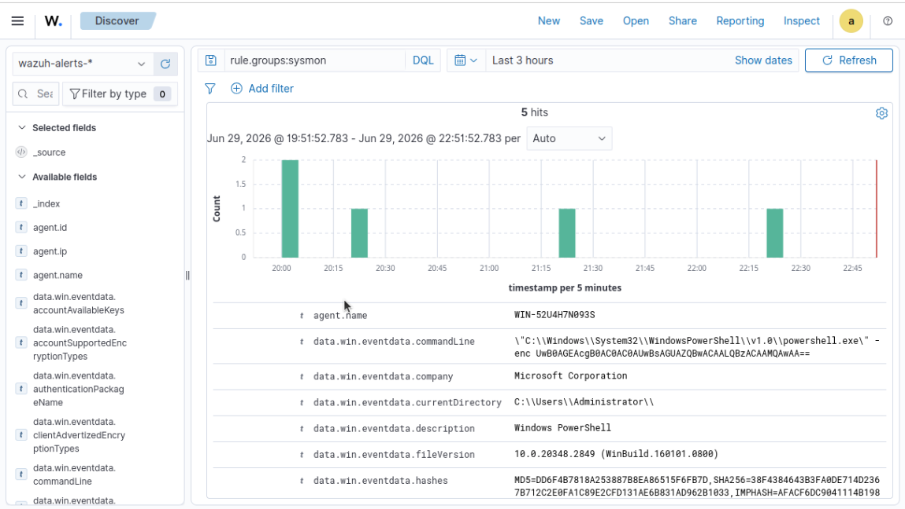
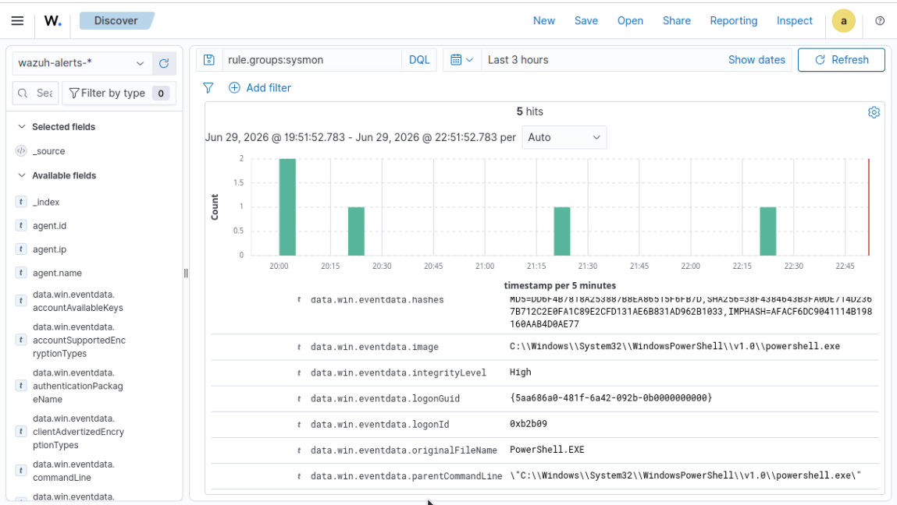

# Detection 002: PowerShell Encoded Command Execution

| Date | Integrity-level | MITRE ATT&CK | Technique Name | Sub-Technique | Tactic |
|------|-----------------|--------------|----------------|---------------|--------|
| 29-06-2026 | High | [T1059.001](https://attack.mitre.org/techniques/T1059/001/) | Command and Scripting Interpreter | Powershell | Execution |

### Screenshot Evidence 

### Trigger

Opened Powershell as Admin on Windows Server and executed an encoded command using the -enc flag:

powershell -enc UwB0AGEAcgB0AC0AUwBsAGUAZQBwACAALQBzACAAMQAwAA==
